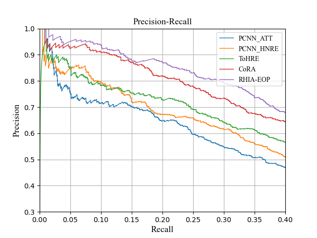

# RHIA-EOP
A pytorch implementation of the paper: "Distantly Supervised Relation Extraction via Recursive Hierarchy-Interactive Attention and Entity-Order Perception".

## Requirements
The model is implemented using Pytorch. The versions of packages used are shown below.
* python==3.7.9
* pytorch==1.7.1
* cuda == 10.1
* numpy==1.19.2
* tqdm==4.55.1
* scikit_learn==0.23.2

## Data
Unzip the data `./raw_data/data.zip`under `./data/`

```
unzip ./raw_data/data.zip -d ./data/
```


## Use pretrained model
The pretrained model is already saved at `./result/checkpoint/`. To directly evaluate on it, run the following command:

```
python evaluate.py --model RHIA-EOP --processed_data_dir ./_processed_data/RHIA-EOP/ --save_dir result/checkpoint/ --ent_order eop --hier_rel_net rhia --pone --ptwo --pall
```

P-R curve, the curve will be saved at `./result/checkpoint/`:
```
python show_pr.py RHIA-EOP
```

## Train the model
```
python main.py --model RHIA-EOP --processed_data_dir ./_processed_data/RHIA-EOP/ --save_dir ./result/RHIA-EOP/ --ent_order eop --hier_rel_net rhia
```

## Evaluate the model
```
python evaluate.py --model RHIA-EOP --processed_data_dir ./_processed_data/RHIA-EOP/ --save_dir ./result/RHIA-EOP/ --ent_order eop --hier_rel_net rhia --pone --ptwo --pall
```


## Experiment results

### P-R curve



### AUC & Max_F1

| AUC  | Max_F1 |
| :----: | :---: |
| 0.56 | 0.546 |

### P@N (%)

| P@100  | P@200 | P@300 | P@500 | P@1000  | P@2000 | Mean | 
| :----: | :---: | :---: | :--: | :----: | :---: | :---: | 
| 95.0 | 94.0 | 89.7 | 85.2 | 71.7 | 53.2 | 81.5 |

### P@N (Use the setting of Li et al.)

* pone

| P@100  | P@200 | P@300 | Mean | 
| :----: | :---: | :---: | :--: |
| 96.0 | 92.5 | 86.7 | 91.7 | 

* ptwo

| P@100  | P@200 | P@300 | Mean | 
| :----: | :---: | :---: | :--: |
| 98.0 | 95.5 | 92.3 | 95.3 | 

* pall

| P@100  | P@200 | P@300 | Mean | 
| :----: | :---: | :---: | :--: |
| 98.0 | 96.5 | 93.3 | 95.9 |

### Hits@K (macro)

| < 100  | 10 | 15 | 20 | 
| :----: | :---: | :---: | :--: |
| RHIA-EOP | 66.7 | 83.3 | 94.4 |

| < 200  | 10 | 15 | 20 | 
| :----: | :---: | :---: | :--: |
| RHIA-EOP | 72.7 | 86.4 | 95.5 |